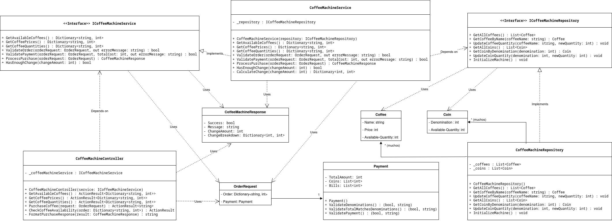

# Examen 2 - Coffee Machine

**Curso:** CI-0128 - Ingeniería de Software
**Estudiante:** Kyara Vannesa Muñoz Ramírez - C15380
**Profesora:** Rebeca Obando Vásquez
II Semestre, 2025

## Instalación y Ejecución

1. **Clonar el repositorio**

    ```bash
    git clone https://github.com/KyaraMR/IS-II-2025
    cd Examen2 && cd ExamTwo
    ```

2. **Restaurar dependencias**

    ```bash
    dotnet restore
    ```

3. **Ejecutar la aplicación**

    ```bash
    dotnet run
    ```

4. **Acceder a Swagger UI**

https://localhost:7183/swagger

http://localhost:5059/swagger

## Endpoints de la API

### GET Endpoints

- /api/CoffeeMachine/coffees: Obtiene los cafés disponibles con cantidades
- /api/CoffeeMachine/prices: Obtiene los precios de los cafés
- /api/CoffeeMachine/quantities: Obtiene las cantidades disponibles

### POST Endpoints

- /api/CoffeeMachine/purchase: Realiza una compra de café
- /api/CoffeeMachine/check-availability: Verifica disponibilidad sin comprar

## Especificaciones de Pago

**Monedas aceptadas:**

- 500 colones
- 100 colones
- 50 colones
- 25 colones

**Billetes aceptados:** 1000 colones (únicamente)

### Validaciones

- Solo se aceptan las denominaciones especificadas
- El TotalAmount debe coincidir con la suma de monedas y billetes
- La máquina debe tener cambio suficiente

## Ejecutar pruebas unitarias

```bash
cd ExamTwo.Tests
dotnet test
```

## Diagrama UML



## Mockup del Frontend


